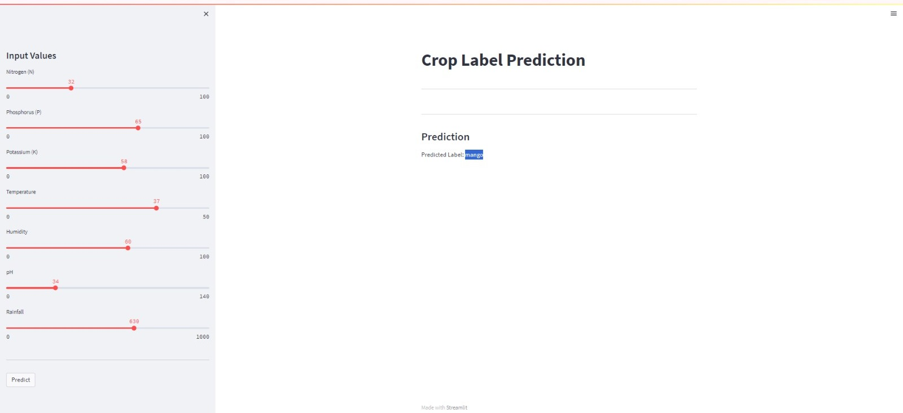

# Suitable Crop Prediction using Machine Learning

## Project Overview
The Suitable Crop Prediction project aims to help farmers choose the best crops for their specific regions by analyzing environmental and soil conditions using machine learning. The project integrates data collection, preprocessing, and analysis to provide accurate crop recommendations.

## Features
- **Data Collection and Analysis**: Gathered data on soil quality, climate, and crop yields for comprehensive analysis.
- **Machine Learning Model**: Implemented various machine learning algorithms to predict the most suitable crops.
- **Interactive Interface**: Created a user-friendly interface for farmers to input their local data and receive crop recommendations using streamlit.
- **High Accuracy**: Achieved high prediction accuracy to optimize crop selection for better yields.

## Getting Started

To run the Suitable Crop Prediction project locally, follow these steps:

1. **Clone the Repository**: `git clone https://github.com/imAnujMishra/Suitable-Crop-Prediction.git`
   

2. **Run the Application**: Execute the main application script `main.py`  to start the prediction system.

## Contributing

Contributions to the Suitable Crop Prediction project are welcome! If you find any issues or have suggestions for improvements, please submit an issue or pull request on the GitHub repository. For major changes, please open an issue first to discuss the proposed modifications.

## You can reach me at
[LinkedIn](https://www.linkedin.com/in/anujmishra2003/)

